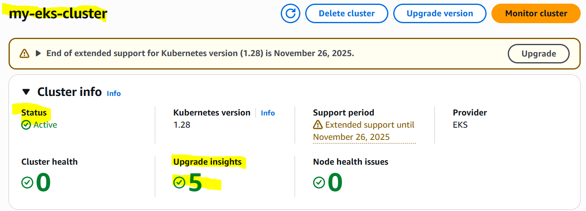
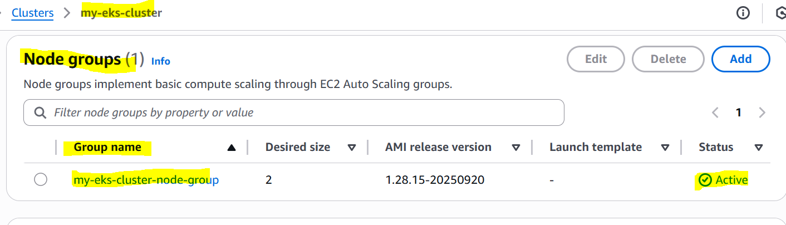
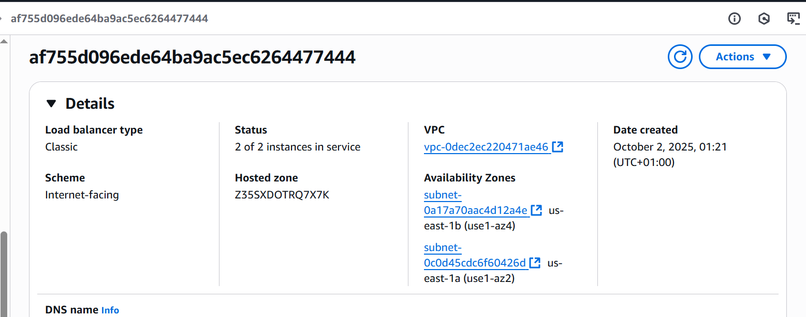

# Retail Store EKS Deployment

This project provisions the **Retail Store Sample Application** on **Amazon Elastic Kubernetes Service (EKS)** using **Terraform**.
It demonstrates cloud infrastructure automation, container orchestration, and best practices for deploying a microservices-based app.

---

## í³‚ Project Structure

```
.
├── main.tf                # Main entry point
├── vpc.tf                 # VPC, subnets, route tables
├── eks.tf                 # EKS cluster and node groups
├── iam.tf                 # IAM roles and policies
├── providers.tf           # AWS provider configuration
├── variables.tf           # Input variables
├── outputs.tf             # Terraform outputs
├── aws-auth.yaml          # ConfigMap for worker node access
├── docs/
│   └── Deployment_Architecture_Guide.md   # Detailed architecture guide
└── retail-store/          # App manifests (Kubernetes YAMLs)
```

---

## íº€ Deployment Guide

### Prerequisites

* AWS Account with sufficient permissions
* Terraform ≥ v1.5 installed
* kubectl installed
* AWS CLI configured with your credentials

### Steps

1. Clone this repository:

   ```bash
   git clone https://github.com/adada-e/retail-store-eks.git
   cd retail-store-eks
   ```

2. Initialize Terraform:

   ```bash
   terraform init
   ```

3. Review and apply the configuration:

   ```bash
   terraform apply
   ```

4. Update your kubeconfig to access the cluster:

   ```bash
   aws eks update-kubeconfig --region <your-region> --name retail-store-cluster
   ```

5. Deploy the Retail Store application:

   ```bash
   kubectl apply -f retail-store/
   ```

6. Verify pods are running:

   ```bash
   kubectl get pods -A
   ```

---

## í³¸ Screenshots (for examiner review)

* EKS cluster created in AWS Console
* `kubectl get nodes` output showing worker nodes
* Application pods running (`kubectl get pods`)
* Sample app accessible via LoadBalancer service

---

## í²° Cost Optimization

⚠� Note:
EKS and NAT Gateway incur ongoing hourly charges.
To avoid unnecessary costs after testing:

```bash
terraform destroy
```

This will clean up all AWS resources but your code will remain reproducible.

---

## � Notes for Examiner

* Resources may have been destroyed to avoid AWS costs.
* To reproduce, run `terraform apply` with the above steps.
* All infrastructure definitions and documentation are included in this repo.
* Architecture details are in [`docs/Deployment_Architecture_Guide.md`](docs/Deployment_Architecture_Guide.md).

##
--------
## Screenshots

### EKS Cluster



### Node Group



### Load Balancer



---

í±¨â€�í²» **Author**: Adada E
AltSchool Cloud Engineering Project 
